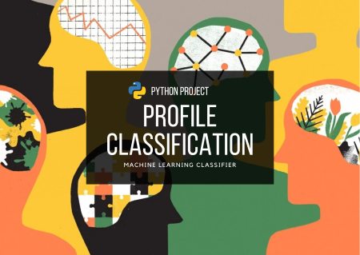
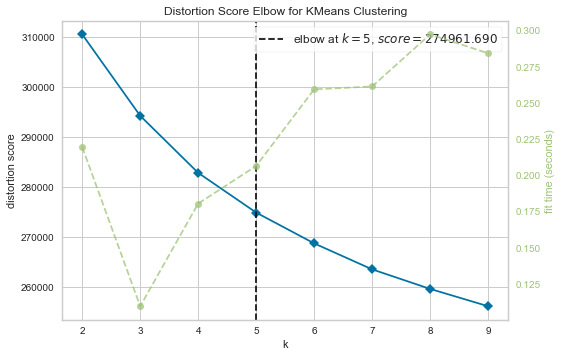
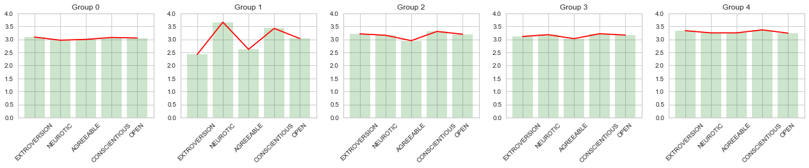

# Five Personality Trait

<!---Esses são exemplos. Veja https://shields.io para outras pessoas ou para personalizar este conjunto de escudos. Você pode querer incluir dependências, status do projeto e informações de licença aqui--->

### :speech_balloon: Background Information

The Big Five personality traits, also known as the five-factor model (FFM) and the OCEAN model, is a taxonomy, or grouping, for personality traits. When factor analysis (a statistical technique) is applied to personality survey data, some words used to describe aspects of personality are often applied to the same person. For example, someone described as conscientious is more likely to be described as "always prepared" rather than "messy". This theory is based therefore on the association between words but not on neuropsychological experiments. This theory uses descriptors of common language and therefore suggests five broad dimensions commonly used to describe the human personality and psyche.

This dataset contains 1,015,342 questionnaire answers collected online by Open Psychometrics.

This notebook seeks to develop a machine learning application to define and classify personality clusters.

https://www.kaggle.com/datasets/tunguz/big-five-personality-test

### :rocket: Objectives

> - Identify how many clusters can be obtained from the data.
> - Develop a tool that classifies the dataset by clusters.
> - Create an interface that indicates which cluster your personality belongs to.

## :chart_with_upwards_trend: Results

> - Five clusters (k=5) were identified from the dataset.
> - It was possible to group all dataset responses into the 5 identified clusters.
> - Interface that interacts with the user returns the cluster that he belongs to from a quiz.
<!--## :bar_chart: Images-->
<table>
  <tr>
    <td align="center">
      <a href="image-1.png">
         
        
          <b>KMeans Distortion Score indicates k=5</b>
        
      </a>
    </td>
    <td align="center">
      <a href="image-2.png">
         
        
          <b>Data classification</b>
        
      </a>
    </td>
</table>
